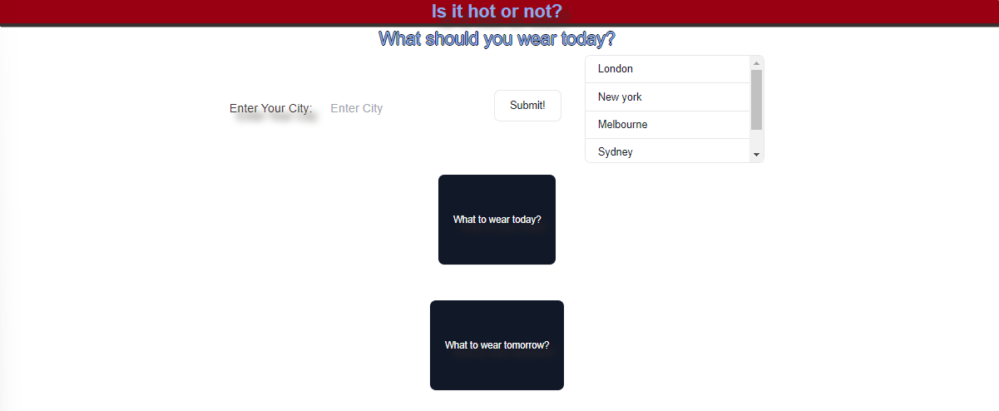
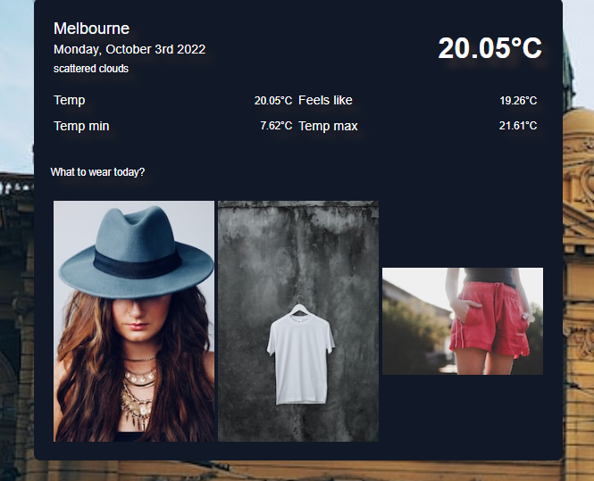

# Hot-or-Not
How hot is it? And what should you wear?

This applicaiton sets out to solve the age old dilemma of what to wear today.

Provide users with clothing suggestions based on the weather in a location that they search for.

This project has been deployed to GitHub pages. To access this project click the deployement link below:

https://web3zero.github.io/hot-or-not-grp6/

Or, download the source files to use as a template.

# Getting Started
This project has been deployed to GitHub Pages. To access this project click the deployment link below. Or, download the sources files to use this as a template.
- https://github.com/Web3Zero/hot-or-not-grp6

# Pre-requisites
If you wish to use this as a template you will need a text editor. Visual Studio Code was used to create this project and is the recomended application.

# Installing
To install this code, download the zip file, or use GitHub's guidelines to clone the repository.

# Summary

This project utilises javaScript, jquery, tailwind CSS & moment.js to create a weather app that allows user to input a city in the world, and then present be presented with the following elements:

- City name;
- date;
- conditions;
- temperature - current, feels like, min and max;
- the background is changed to a picture of the city searched;
- presented with three suggest items to wear for the conditions;

It also logs the users search into a list of cities searched so that the user is able to simply click a prior searched city and be presented with the results.

Upon opening the app the user is presented with the following landing page:

# Features

This project has the following features:

## Search bar

As part of the function the user is presented with an input box in which to type a city name to search

When a search is complete it logs the item into local storage to be accessed in the below section

##  Previous searched cities

The user is also presented with a list of historically searched cities with the most recent search at the top:

This section access local storage gets the historical searched city and presents as a list.

##  What to wear today and what to wear tomorrow

The results of the searched city are presented in these sections. It presents the conditions as well as images of suggested outfits.

# Functionality

In order to create the above features the code performs as follows:

Upon clicking "search" in the city button the following happens:

1. Take the City name value and push to the display city span. This creates a header for the current weather box;
2. Take the City name value and push into an api call in getUserChoice this is done to obtain the lat and long so that a second call can be performed with these values to get weather for today and tomorrow;
3. Save the value to localStorage this is done so that the values can then be presented to users for previous searches
4. Present the value as a button in the previous-list table store city name so that the search can be redone without typing in again present the historical search on side bar so that it can be selected present this in reverse order
5. Utilises the city name to search through second api to get an image of the city to provide in the background
6. Uses the weather conditions from the original call to search through an object array to obtain a value for three image searches to run.

If a user clicks on a previously searched city button the above functionality is performed, however the code will pull the previously searched city using the following code:

this will then replace the first API call with this previous value and recycle step 2. It will not perform steps 3 and 4 since the city will be in the list already. It will also fire the value to the images API to call the values for that.

# To excute file
Open in brower and either click on a searched city item or type a city name and search.

# File features

- one HTML page "index.html"
- one CSS page "style.css"
- two Javascript pages 
    - "script.js" webpage functionality
    - "weatherConditionsArray.js" list of weather condition codes along with outfit suggestions
- use of the following third party API's
    - moment.js - https://cdnjs.cloudflare.com/ajax/libs/moment.js/2.24.0/moment.min.js
    - jquery - https://code.jquery.com/jquery-3.4.1.min.js
    - tailwind CSS - https://unpkg.com/tailwindcss@2.2.19/dist/tailwind.min.css 
- use of the following serverside API's
City API Call openweathermap - "https://api.openweathermap.org/geo/1.0/direct?q=" +cityInput.value+ "&limit=1&appid=" + APIKey;
- Lat lon API Call openweathermap - "https://api.openweathermap.org/data/2.5/onecall?lat=" + lat + "&lon=" + lon + "&units=metric&exclude=hourly,minutely&appid=" + APIKySecond;
- Images API call Unsplash for outfits - 'https://api.unsplash.com/search/photos?query=' + weatherConditions[description].top +'&client_id=' + UnslplashClientID;
- Images API call Unsplash for background - 'https://api.unsplash.com/search/photos?query=' + cityInput.value +'&client_id=' + UnslplashClientID;

# Authors
- Dallas Gourley, Sharon Kim & Ash Shilkin
- Various code found online and repurposed to fit requirements

# Acknowledgements
Thanks to Evan Woods and James Brown for guidence and inspiration.